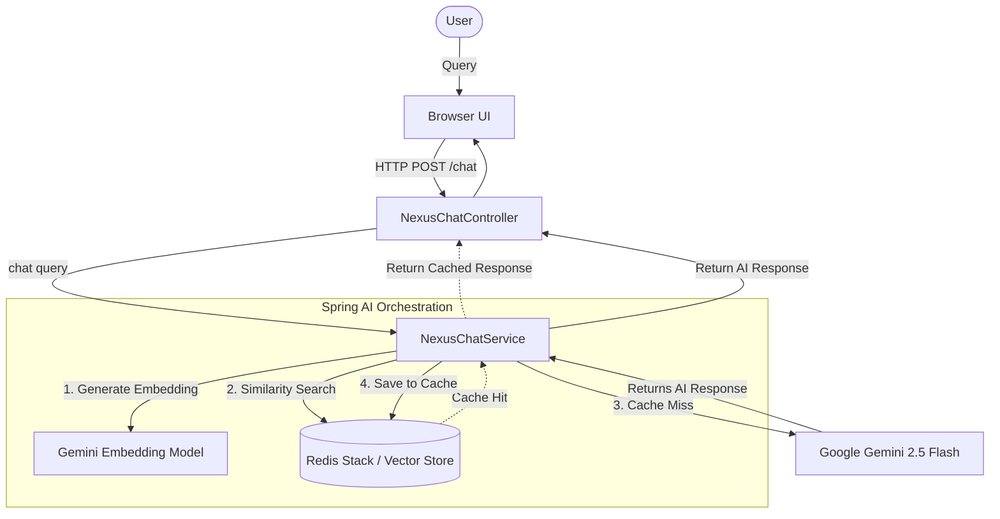

# Nexus AI Shopping Assistant 🚀

Nexus is an intelligent e-commerce shopping assistant built with **Spring AI**, **Google Gemini 2.5 Flash**, and **Redis Vector Search**. It features a high-performance **Semantic Cache** that drastically reduces latency and API costs for repetitive or similar customer queries.

## ✨ Key Features
- **Generative AI**: Powered by Google's state-of-the-art **Gemini 2.5 Flash** model.
- **Semantic Caching**: Uses **Redis Vector Store** to find and reuse answers for similar past questions.
- **Cost Efficient**: Bypasses expensive LLM calls when a high-quality cached answer is available.
- **Modern Tech Stack**: Spring Boot 3.4, Java 21, and Spring AI.
- [x] Clean UI: Responsive web interface for seamless shopping interactions.

## 🏗️ Architecture Diagram



## 🛠️ Technology Stack
- **Backend**: Java 21, Spring Boot 3.4
- **AI Framework**: Spring AI 1.1.2
- **Vector DB**: Redis Stack (RedisJSON + RedisSearch)
- **Model**: Google Gemini 2.5 Flash

## 🚀 Quick Start

### Prerequisites
- Java 21
- Docker (for Redis Stack)
- Gemini API Key

### Running with Docker (Recommended)
1. Start Redis Stack:
   ```bash
   docker-compose up -d
   ```

2. Set your Gemini API Key:
   ```bash
   export GEMINI_API_KEY=your_api_key_here
   ```

3. Build and Run:
   ```bash
   ./mvnw clean package -DskipTests
   java -jar target/nexus-0.0.1-SNAPSHOT.jar
   ```

4. Access the UI:
   Open `http://localhost:8080` in your browser.

## 🧠 How Semantic Cache Works
When a user asks a question:
1. Nexus generates an embedding for the query.
2. It searches the **Redis Vector Store** for similar queries.
3. If a match is found with a similarity score above the threshold (0.4), the cached response is returned immediately.
4. If no match is found (cache miss), the query is sent to **Gemini 2.5 Flash**, and the new response is saved back to the cache.

## 📄 License
MIT License
